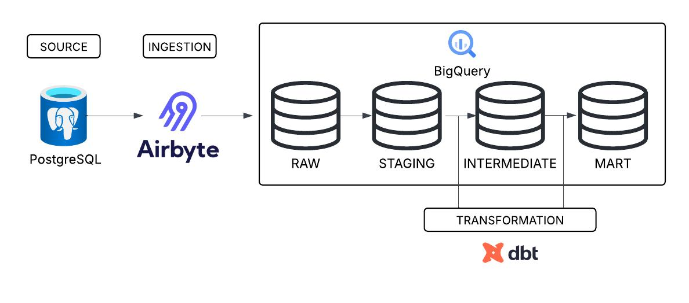

# Production-Grade Mobility Analytics Platform
An end-to-end, production-ready dbt transformation layer for a UK-based mobility startup. Features modular dimensional modeling, automated data quality testing, and comprehensive documentation to power ride-hailing analytics.

## Architecture Diagram
 

## Project Stack
1. Aribyte - Ingestion from Postgres transactional DB to raw warehouse layer
2. dbt-core - Transformation, testing, documentation
3. BigQuery - Cloud data warehouse
4. GitHub - Version control

## Objectives
The goal of this project is to build a production-grade analytics engine that transforms raw mobility data into actionable growth levers. By completion, the platform will deliver:

1. Financial Intelligence: Automated tracking of daily revenue by city, gross vs. net margins, and corporate vs. personal account splits.

2. Operational Optimization: Driver performance rankings, real-time activity monitoring, and churn tracking.

3. Customer Insights: Accurate Rider Lifetime Value (LTV) and payment failure rate analysis.

4. Strategic Growth: High-fidelity reporting on surge pricing impact and fraud detection patterns.


## Implementation

### 1. Staging Layer

Each raw table has a staging model that performs:
- Column renaming to `snake_case`
- Correct data type casting
- Deduplication on primary keys
- Timestamp standardisation via `to_utc()` macro
- Filtering of null or invalid primary keys

**Models:** `stg_cities`, `stg_drivers`, `stg_trips`, `stg_payments`, `stg_riders`, `stg_driver_status_events`

Source definitions include descriptions, freshness checks, and column-level tests.

---

### 2. Intermediate Layer
| Model | Logic |
|-------|-------|
| `int_trips_enriched` | Trip duration, corporate flag, surge flag, rider type |
| `int_payments_enriched` | Net revenue, duplicate payment detection |
| `int_fraud_flags` | Fraud detection: expected vs actual fare vs amount paid |
| `int_driver_lifetime_trips` | Completed trip count per driver |
| `int_rider_lifetime_value` | Total net revenue per rider |

**Macros:**

| Macro | Purpose |
|-------|---------|
| `to_utc(col)` | Converts UK timestamps to UTC |
| `get_net_revenue(amount, fee)` | Net revenue after fee deduction |
| `get_duration_minutes(start, end)` | Trip duration in minutes |


### 3. Marts Layer — Star Schema

**Dimensions:**

| Table | Type | Description |
|-------|------|-------------|
| `dim_cities` | Type 1 | City attributes |
| `dim_riders` | Type 1 | Rider profile + lifetime value |
| `dim_drivers_current` | Type 1 | Latest driver state |
| `dim_drivers_history` | Type 2 SCD | Full driver change history |

**Facts:**

| Table | Grain | Description |
|-------|-------|-------------|
| `fct_trips` | Per trip | Financials, fraud flags, point-in-time driver attributes |
| `fct_payments` | Per payment | Payment details, fraud signals, fare comparisons |


### 4. Snapshots — SCD Type 2
`fct_trips` performs a **point-in-time join** to `dim_drivers_history` on `pickup_at` to capture the driver's exact state at the time of the trip.


### 5. Incremental Models

**Why incremental is required:**
BeejanRide processes high trip volumes across 5 cities. Full refreshes would be expensive and slow at scale. Incremental models process only new or updated records, reducing cost and runtime significantly.

**Tradeoffs:**

| | Full Refresh | Incremental |
|--|-------------|-------------|
| Correctness | Always fully correct | Risk of missing late-arriving data |
| Cost | Expensive at scale | Efficient |
| Speed | Slow on large tables | Fast |
| Complexity | Simple | Requires `unique_key` + filter logic |


### 6. Data Quality

**Generic tests:** `unique`, `not_null`, `relationships`, `accepted_values`

**Custom tests:**

| Test | Description |
|------|-------------|
| `no_negative_revenue` | Asserts `net_revenue >= 0` |
| `positive_trip_duration` | Asserts `duration_minutes > 0` |
| `completed_trip_has_payment` | Every completed trip has a successful payment |


### 7. Documentation & Governance

Every model includes model descriptions, column descriptions, business metric definitions, owner metadata, and tags (`finance`, `operations`, `fraud`).
```bash
dbt docs generate
dbt docs serve


## Design Decisions

**Star schema over wide tables** — reduces redundancy, allows dimension reuse across facts, maps cleanly to BI tools.

**Two driver dimensions** — `dim_drivers_current` for fast current-state lookups; `dim_drivers_history` for accurate point-in-time historical analysis used in fraud detection and churn tracking.

**Intermediate models as views** — lightweight transformation pass over incremental staging models; materialising as tables adds unnecessary cost.


## Tradeoffs

| Decision | Tradeoff |
|----------|---------|
| Incremental staging | Risk of missed records on late-arriving data |
| SCD Type 2 on drivers only | Historical changes to riders and cities are not preserved |
| Fraud logic as view | Recomputes on every query — can be materialised if performance degrades |
| Surrogate key on history dim | Adds complexity but required for correct point-in-time joins |


## Future Improvements

- SCD Type 2 snapshot for riders
- dbt unit tests for macro logic
- `dbt-expectations` for advanced data quality checks
- dbt Semantic Layer for standardised KPI definitions
- Alerting on freshness failures via Slack or PagerDuty
- Partition `fct_trips` and `fct_payments` by date for query cost control


## Test Queries

### Daily Revenue per City
```sql
SELECT
    c.city_name,
    DATE(t.pickup_at)     AS trip_date,
    SUM(t.net_revenue)    AS net_revenue,
    SUM(t.actual_fare)    AS gross_revenue,
    COUNT(t.trip_id)      AS total_trips
FROM fct_trips t
JOIN dim_cities c ON t.city_id = c.city_id
WHERE t.status = 'completed'
GROUP BY 1, 2
ORDER BY 2 DESC
```

### Corporate vs Personal Revenue Split
```sql
SELECT
    rider_type,
    SUM(net_revenue)  AS total_net_revenue,
    COUNT(trip_id)    AS total_trips,
    ROUND(SUM(net_revenue) / SUM(SUM(net_revenue)) OVER () * 100, 2) AS pct
FROM fct_trips
WHERE status = 'completed'
GROUP BY 1
```

### Top 10 Drivers by Revenue
```sql
SELECT
    d.driver_id,
    d.rating,
    d.driver_lifetime_trips,
    SUM(t.net_revenue) AS total_revenue
FROM fct_trips t
JOIN dim_drivers_current d ON t.driver_id = d.driver_id
WHERE t.status = 'completed'
GROUP BY 1, 2, 3
ORDER BY 4 DESC
LIMIT 10
```

### Payment Failure Rate
```sql
SELECT
    payment_provider,
    COUNT(*)                              AS total_payments,
    COUNTIF(payment_status = 'failed')    AS failed_payments,
    ROUND(COUNTIF(payment_status = 'failed') / COUNT(*) * 100, 2) AS failure_rate_pct
FROM fct_payments
GROUP BY 1
ORDER BY 3 DESC
```

### Fraud Detection Insights
```sql
SELECT
    DATE(created_at)                                             AS date,
    COUNTIF(fraud_detected)                                      AS fraud_cases,
    SUM(CASE WHEN fraud_detected THEN amount ELSE 0 END)         AS amount_at_risk
FROM fct_payments
GROUP BY 1
ORDER BY 1 DESC
```


## Running the Project
```bash
# Install packages
dbt deps

# Materialise snapshots first
dbt snapshot

# Run all models
dbt run

# Run tests
dbt test

# Generate docs
dbt docs generate && dbt docs serve
```

### Run by layer
```bash
dbt run --select tag:staging
dbt run --select tag:intermediate
dbt run --select tag:mart
```
